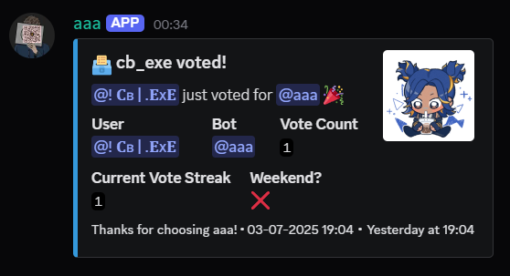

# 🗳️ TopGG Vote Listener (Python)

**TopGG-VoteListener-Python** is a lightweight, modern, and self-hosted webhook listener for [top.gg](https://top.gg) votes, built using `discord.py` and `aiohttp`. It notifies voters via DMs and sends beautiful, informative embeds to a designated log channel.

---

## 🚀 Features

- ✅ Fully compatible with Python 3.12+
- 🔐 Secure webhook authentication
- 📥 Handles top.gg vote webhooks in real-time
- 📊 Tracks total votes and streaks (demo logic included)
- 📬 Sends personalized DMs to voters
- 📢 Logs votes to a Discord channel with rich embeds
- ⚙️ Simple `settings.json` config

---

## 📸 Example Output

> When a user votes, the bot sends a message like this in your log channel:



> When a user votes, the bot also sends a message to the user who voted


---

## 🔧 Setup Instructions

### 1. Clone the Repository

```bash
git clone https://github.com/MaybeCb/Top.gg-Votelistener.git
cd Top.gg-Votelistener
